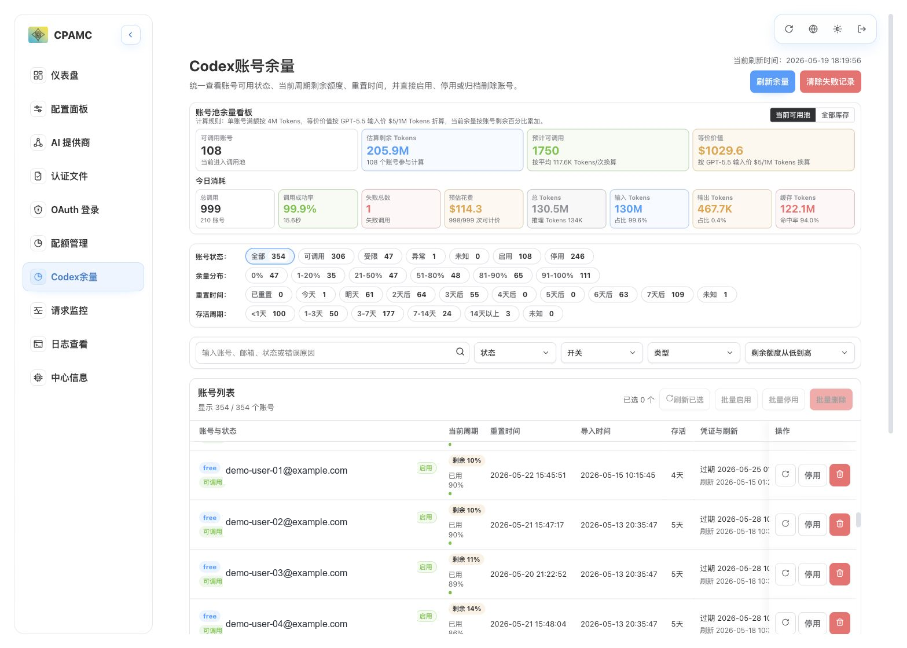
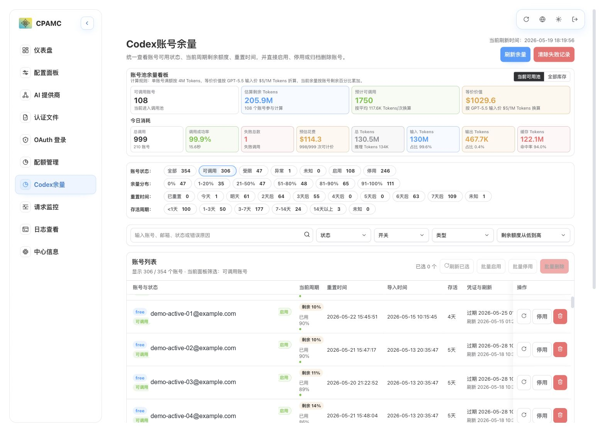
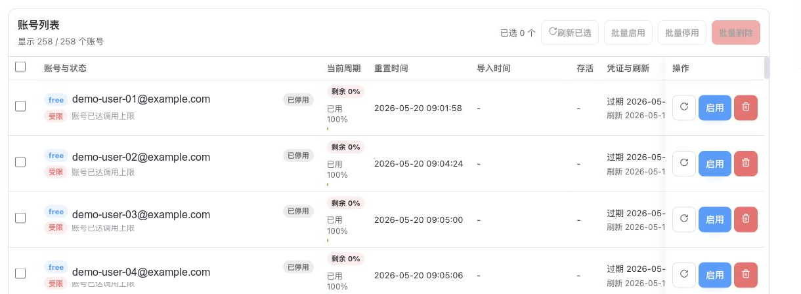

# Codex 余量与请求日志面板部署使用手册

本文档面向想直接使用 Docker 部署的用户。你不需要编译代码，只需要准备好已经运行的 CLIProxyAPI、Codex 账号文件目录、CLIProxyAPI logs 目录和 Docker。

部署后可以在浏览器中查看：

- Codex 账号余量和重置时间
- 账号池总余量估算
- 今日已重置账号
- 账号启用、停用、删除
- 批量刷新、刷新已选账号
- 清除失败调用记录
- 请求日志分析：按任务查看请求体、账号分发、Responses SSE、上游 SSE 和原始请求
- Usage 用量统计、调用监控、模型费用估算
- 原 CPA 管理面板中的配置、AI 提供商、认证文件、OAuth、日志、系统信息等功能

## 0. 分支说明

本文档适用于 `request-log-page` 分支。这个分支在 Codex 余量面板基础上，增加请求日志页面、日志目录挂载和配套使用说明。

建议按下面的分支边界使用：

| 分支                | 用途                                                 |
| ------------------- | ---------------------------------------------------- |
| `main`              | 跟随原 CPA-Manager / CPAMC 上游代码，不混入定制功能  |
| `codex-quota-panel` | 只维护 Codex 余量面板、Docker 分享部署和配套使用文档 |
| `request-log-page`  | 增加请求日志页面，并保留 Codex 余量面板能力          |

如果你是从 GitHub 获取代码，请确认当前分支是：

```bash
git checkout request-log-page
```

## 1. 适合谁使用

适合以下场景：

1. 已经在本地或服务器部署了 CLIProxyAPI。
2. 有一批 Codex 账号 JSON 文件。
3. 希望直观看到每个账号的剩余额度、重置时间、是否受限。
4. 希望按任务查看 CLIProxyAPI 收到的请求、选择的账号、SSE 流和 Responses 返回。
5. 希望用 Docker 一键启动管理面板。
6. 希望把面板分享给其他用户，但不暴露自己的账号、密钥、数据库和本地路径。

不适合以下场景：

1. 还没有部署 CLIProxyAPI。
2. 想把服务直接暴露到公网且没有额外登录保护。
3. 希望镜像里预置账号文件或密钥。

## 2. 整体架构

```text
浏览器
  -> CPA-Manager 面板 :18317
      -> 内置管理页面
      -> 读取 /data/usage.sqlite
      -> 读取 /auths 下的 Codex 账号文件
      -> 只读挂载 /request-logs 下的 CLIProxyAPI request-log 文件
      -> 代理访问 CLIProxyAPI Management API

CLIProxyAPI
  -> 提供 /v0/management/*
  -> 提供 usage queue
  -> 使用自己的 auths 账号目录
```

面板不包含 CLIProxyAPI 本体。CLIProxyAPI 需要单独运行。

## 3. 准备条件

你需要准备：

| 项目             | 说明                                 |
| ---------------- | ------------------------------------ |
| CLIProxyAPI      | 已经启动，并且 Management API 可用   |
| Management Key   | CLIProxyAPI 的管理密钥               |
| Codex auths 目录 | 存放 Codex 账号 `.json` 文件的目录   |
| request-log 目录 | CLIProxyAPI 写入请求日志的 logs 目录 |
| Docker           | Docker Desktop 或 Docker Engine      |
| docker compose   | Docker Desktop 通常已自带            |

CLIProxyAPI 建议开启：

```yaml
usage-statistics-enabled: true
request-log: true
remote-management:
  allow-remote: true
```

如果你只在本机使用，也可以按自己的安全策略限制访问范围。

## 4. 需要分享给用户的文件

分享给其他用户时，只需要给这些内容：

1. 本文档：`docs/codex-quota-docker.md`
2. Compose 文件：`docker-compose.codex-quota.yml`
3. 配置模板：`.env.example`
4. 手册截图：`img/codex-quota-*.png`

不要分享：

- `.env`
- `auths/`
- `data/`
- `reports/`
- `deleted-auths/`
- `*.sqlite`
- 请求日志文件
- 任何真实 Management Key
- 任何真实账号 JSON

## 5. 安装部署方式

先说结论：

- 想省事，选 **AI 安装**
- 想自己动手，选 **Docker 安装**
- 想自己改代码或重新打镜像，选 **源码构建安装**

### 5.1 方式一：让 AI 帮你安装

如果你不想自己看命令，可以直接把下面这句话发给 AI：

```text
请帮我在当前电脑上部署 CPA-Manager 的 request-log-page 分支。使用 Docker 方式启动，保留我的账号文件和数据，不要读取、上传或提交 .env、auths、data、SQLite、请求日志和任何密钥。请根据我的 CLIProxyAPI 地址、Management Key、Codex auths 目录和 CLIProxyAPI logs 目录完成配置，启动后告诉我访问地址和是否启动成功。
```

你只需要再准备 4 个信息给 AI：

| 信息             | 说明                             |
| ---------------- | -------------------------------- |
| CLIProxyAPI 地址 | 例如 `http://cli-proxy-api:8317` |
| Management Key   | 你自己的管理密钥                 |
| auths 目录       | 存放 Codex JSON 文件的本地目录   |
| logs 目录        | CLIProxyAPI request-log 日志目录 |

### 5.2 方式二：Docker 安装（推荐）

这是最适合大多数人的方法。你只要照着做，不需要理解代码。

#### 第一步：拉取代码

如果你还没有仓库，可以直接拉取：

```bash
git clone -b request-log-page https://github.com/yifengai/CPA-Manager.git
cd CPA-Manager
```

如果你已经有本地代码目录，直接进入那个目录就行。

#### 第二步：准备配置文件

复制一份配置文件：

```bash
cp .env.example .env
```

打开 `.env`，至少改这 4 项：

```env
CPA_MANAGEMENT_KEY=your-own-management-key
CPA_CODEX_AUTH_PATH=/absolute/path/to/your/auths
CPA_REQUEST_LOG_PATH=/absolute/path/to/CLIProxyAPI-main/logs
CPA_UPSTREAM_URL=http://cli-proxy-api:8317
```

字段说明：

| 字段                            | 必填 | 说明                                                            |
| ------------------------------- | ---- | --------------------------------------------------------------- |
| `CPA_MANAGER_IMAGE`             | 是   | 面板镜像地址                                                    |
| `CPA_MANAGER_PORT`              | 是   | 面板访问端口，默认 `18317`                                      |
| `CPA_MANAGEMENT_KEY`            | 是   | CLIProxyAPI Management Key                                      |
| `CPA_CODEX_AUTH_PATH`           | 是   | 本机 Codex 账号 JSON 文件目录                                   |
| `CPA_REQUEST_LOG_PATH`          | 否   | CLIProxyAPI request-log 日志目录，不配置时请求日志页面无数据    |
| `CPA_UPSTREAM_URL`              | 是   | 容器内访问 CLIProxyAPI 的地址                                   |
| `CODEX_QUOTA_ESTIMATE_TOKENS`   | 否   | 单账号周期估算 Tokens                                           |
| `CODEX_QUOTA_ESTIMATE_COST_USD` | 否   | 单账号周期估算价值，默认按 GPT-5.5 输入价格 $5 / 1M tokens 估算 |
| `CODEX_QUOTA_ESTIMATE_CALLS`    | 否   | 单账号周期估算调用次数                                          |

#### 第三步：选对 CLIProxyAPI 地址

如果 CPA-Manager 和 CLIProxyAPI 在同一个 Docker 网络中：

```env
CPA_UPSTREAM_URL=http://cli-proxy-api:8317
```

如果 CLIProxyAPI 跑在 Docker Desktop 宿主机上：

```env
CPA_UPSTREAM_URL=http://host.docker.internal:8317
```

如果 CLIProxyAPI 跑在另一台机器上：

```env
CPA_UPSTREAM_URL=http://your-server-ip:8317
```

#### 第四步：启动

```bash
docker compose -f docker-compose.codex-quota.yml --env-file .env up -d
```

#### 第五步：打开页面

默认地址：

```text
http://127.0.0.1:18317/management.html#/codex-quota
```

如果部署在服务器上，把 `127.0.0.1` 换成服务器地址。

### 5.3 方式三：源码构建安装

这种方式适合开发者，或者你想自己改页面、改文案、改功能后再打镜像。普通用户不需要看这一节。

你需要先准备：

- Node.js
- Docker
- docker compose

执行步骤：

```bash
git clone -b request-log-page https://github.com/yifengai/CPA-Manager.git
cd CPA-Manager
npm install
npm run build
docker build -f Dockerfile.usage-service -t cpa-manager:request-log-page-local .
cp .env.example .env
```

然后打开 `.env`，把镜像改成本地镜像：

```env
CPA_MANAGER_IMAGE=cpa-manager:request-log-page-local
```

再按 Docker 安装方式填写 `CPA_MANAGEMENT_KEY`、`CPA_CODEX_AUTH_PATH`、`CPA_UPSTREAM_URL`，最后启动：

```bash
docker compose -f docker-compose.codex-quota.yml --env-file .env up -d
```

### 5.4 这几种方式怎么选

| 方式        | 适合谁                         | 难度 |
| ----------- | ------------------------------ | ---- |
| AI 安装     | 完全不想自己看命令的人         | 低   |
| Docker 安装 | 想自己照着做，但不想改代码的人 | 低   |
| 源码构建    | 想自己改代码或重新打镜像的人   | 高   |

## 6. 登录与首次连接

打开页面后，按页面提示填写：

| 字段           | 填写内容                                                                   |
| -------------- | -------------------------------------------------------------------------- |
| CPA 地址       | 通常填写 `http://cli-proxy-api:8317` 或 `http://host.docker.internal:8317` |
| Management Key | 你的 CLIProxyAPI Management Key                                            |

如果你用的是本文档的 Docker Compose，通常这些值已经通过 `.env` 配置，页面会直接连接。

登录成功后进入管理面板。建议先进入【Codex 余量】页面，点击【刷新余量】。

## 7. Codex 余量页面使用说明

### 7.0 页面总览



截图仅将账号邮箱替换为示例邮箱；账号池余量看板、筛选数量、今日消耗和其它状态信息保留页面原样。

### 7.1 顶部刷新区

| 功能         | 说明                              |
| ------------ | --------------------------------- |
| 当前刷新时间 | 显示最近一次刷新完成的北京时间    |
| 刷新余量     | 查询所有 Codex 账号的最新余量     |
| 清除失败记录 | 删除 Usage 数据库中的失败调用记录 |

进入页面时，【今日消耗】会自动拉取最新 Usage 数据；账号余量不会自动刷新，需要手动点击【刷新余量】。这样可以避免每次打开页面都触发大量账号查询。

### 7.2 账号池余量看板

看板用于估算当前账号池还可以承接多少调用。

| 指标                  | 说明                                        |
| --------------------- | ------------------------------------------- |
| 可调用账号 / 库存账号 | 根据看板右上角【当前可用池 / 全部库存】切换 |
| 预估剩余 Tokens       | 根据每个账号剩余百分比估算                  |
| 预计可调用            | 按 `.env` 里的平均 Tokens/次参数估算        |
| 等价价值              | 按 `.env` 里的美元价值参数估算              |

默认估算参数：

```env
CODEX_QUOTA_ESTIMATE_TOKENS=4000000
CODEX_QUOTA_ESTIMATE_COST_USD=20
CODEX_QUOTA_ESTIMATE_CALLS=34
```

默认价值按 GPT-5.5 官方输入价格 $5 / 1M tokens 估算：4M Tokens 约等于 $20。这个值不是官方账号额度，只是本地估算基准。你可以根据自己的历史用量调整。

### 7.3 今日消耗

【今日消耗】用于查看北京时间当天的 Usage 统计。数据会在进入页面时自动刷新，并写入浏览器缓存；再次点击【刷新余量】时也会同步更新。

| 指标        | 说明                             |
| ----------- | -------------------------------- |
| 总调用      | 今日请求总数                     |
| 调用成功率  | 成功请求占比，并显示平均响应时间 |
| 失败总数    | 今日失败调用数                   |
| 预估花费    | 按模型价格估算的今日成本         |
| 总 Tokens   | 今日总 Tokens，并显示推理 Tokens |
| 输入 Tokens | 今日输入 Tokens 和占比           |
| 输出 Tokens | 今日输出 Tokens 和占比           |
| 缓存 Tokens | 今日缓存 Tokens 和缓存命中率     |

### 7.4 筛选标签

#### 账号状态



| 标签   | 含义                                                               |
| ------ | ------------------------------------------------------------------ |
| 全部   | 所有 Codex 账号                                                    |
| 可调用 | 余量可查、未受限、未出现认证异常的账号                             |
| 受限   | 当前周期触发限制、余量为 0、`allowed=false` 或 `limitReached=true` |
| 异常   | Token 失效、登录凭证无效、认证失败等明确不可用状态                 |
| 未知   | 查询超时、数据不完整或暂时无法判断                                 |
| 启用   | 当前没有被标记为 disabled                                          |
| 停用   | 已停用，不进入调用池                                               |

停用账号仍然可以查询余量和重置时间，但不会进入调用池。

#### 开关、类型和排序

搜索区支持组合筛选：

| 筛选 | 说明                                   |
| ---- | -------------------------------------- |
| 状态 | 可调用、受限、异常、未知               |
| 开关 | 启用、停用                             |
| 类型 | free、Plus、Pro、Team 等账号类型       |
| 排序 | 剩余额度、重置时间、存活时间、账号名称 |

### 7.5 余量分布标签

| 标签    | 含义             |
| ------- | ---------------- |
| 0%      | 当前可用余量为 0 |
| 1-20%   | 低余量           |
| 21-50%  | 中低余量         |
| 51-80%  | 正常余量         |
| 81-90%  | 高余量           |
| 91-100% | 接近满额         |

### 7.6 重置时间标签

| 标签         | 含义                                                     |
| ------------ | -------------------------------------------------------- |
| 已重置       | 当前时间已经超过重置时间，或刷新时检测到今天已进入新周期 |
| 今天         | 今天内重置                                               |
| 明天         | 明天重置                                                 |
| 2天后至7天后 | 对应日期重置                                             |
| 未知         | 没有可靠重置时间                                         |

### 7.7 存活周期标签

存活周期按账号首次导入时间到当前时间计算，用于观察账号批次质量，不直接等同于可用性。

| 标签       | 含义                         |
| ---------- | ---------------------------- |
| `<1天`     | 新导入账号，适合检查导入质量 |
| `1-3天`    | 观察期账号                   |
| `3-7天`    | 正常存活账号                 |
| `7-14天`   | 较稳定账号                   |
| `14天以上` | 长存活账号                   |
| 未知       | 没有可识别的首次导入时间     |

### 7.8 账号列表显示与操作



账号字段分为两行：

```text
[free] 完整邮箱地址                         [启用 / 已停用]
[可调用 / 受限 / 异常 / 未知]  原因说明
```

说明：

| 字段                        | 含义                                                      |
| --------------------------- | --------------------------------------------------------- |
| `free` / `plus` / `pro`     | 账号类型                                                  |
| 完整邮箱地址                | 账号标识，不做省略                                        |
| 启用 / 已停用               | 本地开关状态，决定是否进入调用池                          |
| 可调用 / 受限 / 异常 / 未知 | 账号业务状态                                              |
| 原因说明                    | 例如“已停用，不进入调用池”“账号已达调用上限”“Token已失效” |

账号列表支持：

| 操作     | 说明                                      |
| -------- | ----------------------------------------- |
| 刷新     | 只刷新当前账号                            |
| 启用     | 将账号 JSON 中的 `disabled` 改为 `false`  |
| 停用     | 将账号 JSON 中的 `disabled` 改为 `true`   |
| 删除     | 将账号文件移动到 `deleted-auths` 归档目录 |
| 批量启用 | 对已选账号批量启用                        |
| 批量停用 | 对已选账号批量停用                        |
| 批量删除 | 对已选账号批量归档删除                    |
| 刷新已选 | 只刷新勾选账号                            |

删除不是直接永久删除，而是归档到：

```text
/data/deleted-auths/<时间戳>/
```

## 8. 自动停用规则

当前规则：

1. 账号受限时，默认自动停用。
2. 账号异常时，默认自动停用。
3. 已停用账号不进入调用池。
4. 已停用账号仍可查询余量和重置时间。

这样做的目的是避免受限或异常账号继续参与调用，减少失败请求和无效重试。

## 9. 请求日志页面

【请求日志】页面用于把 CLIProxyAPI 的 request-log 文件整理成可读视图，适合排查一次用户请求从进入代理到返回客户端的完整过程。

页面分为三栏：

| 区域     | 说明                                                                 |
| -------- | -------------------------------------------------------------------- |
| 任务历史 | 按用户任务聚合最近请求，展示每个任务的请求数和 Tokens 总和           |
| 请求列表 | 展示选中任务下的每一次请求，点击后右侧立即切换详情                   |
| 请求详情 | 展示用户请求、返回内容、分发情况、Responses SSE、上游 SSE 和原始请求 |

读取范围：

1. 页面默认读取最近最多 `300` 条请求日志。
2. 这个上限用于控制 request-log 解析耗时和浏览器渲染压力。
3. 如果 CLIProxyAPI logs 目录里有更多历史文件，当前版本不会一次性全部加载。
4. 后续如果需要查看更早历史，建议增加分页或【加载更多】按钮，而不是一次性加载全部日志。

缓存规则：

1. 打开【请求日志】页面时，优先显示浏览器缓存里的上一次结果。
2. 进入页面、切换菜单、切换标签不会自动覆盖当前历史记录。
3. 点击右上角【刷新】时，会先清除旧缓存，再重新读取 CLIProxyAPI logs 目录。
4. 刷新成功后，最新任务、当前选中请求和详情会重新写入浏览器缓存。
5. 如果刷新失败，页面会显示错误提示；你仍可参考当前屏幕中的旧数据，但旧缓存已经按刷新动作清除。

启用步骤：

1. 在 CLIProxyAPI 中开启 request-log。
2. 确认 CLIProxyAPI 的 logs 目录里能看到 `v1-responses-*.log` 文件。
3. 在 `.env` 中设置 `CPA_REQUEST_LOG_PATH=/absolute/path/to/CLIProxyAPI-main/logs`。
4. 重新执行 `docker compose -f docker-compose.codex-quota.yml --env-file .env up -d`。
5. 打开 `http://127.0.0.1:18317/management.html#/request-logs`。

注意：请求日志通常包含原始提示词、返回内容、工具调用、请求头、本机路径，甚至可能包含第三方客户端传入的敏感字段。不要把 request-log 文件、页面截图或导出的详情直接公开分享。

## 10. 用量统计和调用监控

CPA-Manager 会消费 CLIProxyAPI 的 usage queue，并写入 SQLite。

你可以在【调用监控】页面查看：

- 总调用次数
- 成功率
- 平均响应时间
- 失败总数
- 预估花费
- 输入 Tokens
- 输出 Tokens
- 缓存 Tokens
- 推理 Tokens
- 按账号、模型、时间维度筛选

如果看不到历史用量，优先检查：

1. CLIProxyAPI 是否开启 `usage-statistics-enabled: true`。
2. CPA-Manager 是否一直运行。
3. CLIProxyAPI usage queue 保留时间是否太短。
4. 面板是否连接到了正确的 CPA 地址。

## 11. 清除失败记录

在【Codex 余量】页面点击【清除失败记录】后，会删除 Usage SQLite 中标记为失败的调用记录。

它会影响：

- 失败总数
- 成功率
- 失败调用对应的 Tokens 和费用统计

它不会删除：

- 成功调用记录
- auth 账号文件
- CLIProxyAPI 配置
- 原始日志文件

## 12. 升级

进入部署目录后执行：

```bash
docker compose -f docker-compose.codex-quota.yml --env-file .env pull
docker compose -f docker-compose.codex-quota.yml --env-file .env up -d
```

升级不会自动删除：

- `/data/usage.sqlite`
- `/data/deleted-auths`
- 你挂载的 auths 目录

## 13. 备份和恢复

### 13.1 需要备份什么

建议备份：

| 数据           | 位置                                                       |
| -------------- | ---------------------------------------------------------- |
| 用量数据库     | Docker volume `cpa-manager-data` 中的 `/data/usage.sqlite` |
| 已删除账号归档 | `/data/deleted-auths`                                      |
| Codex 账号文件 | `.env` 中的 `CPA_CODEX_AUTH_PATH`                          |
| 配置文件       | `.env`                                                     |

### 13.2 导出用量

可以在调用监控页面使用导出功能，也可以备份 Docker volume。

### 13.3 恢复账号文件

如果误删账号，可以从 `deleted-auths` 对应时间目录中找回 JSON 文件，再放回 auths 目录。

## 14. 隐私和安全

分享给别人前必须确认：

1. `.env` 没有提交。
2. `auths/` 没有提交。
3. `data/` 没有提交。
4. `reports/` 没有提交。
5. SQLite 数据库没有提交。
6. 日志文件没有提交。
7. 文档中没有你的真实本机路径。
8. 文档中没有你的真实 Management Key。
9. Docker 镜像中没有账号文件。

本项目的 `.dockerignore` 已默认排除：

```text
.env
.env.*
auths/
data/
reports/
deleted-auths/
*.log
*.sqlite
*.sqlite-shm
*.sqlite-wal
```

## 15. 维护者发布镜像

如果你是维护者，需要把镜像发布给其他人使用，可以执行：

```bash
docker build -f Dockerfile.usage-service -t ghcr.io/yifengai/cpa-manager:request-log-page .
docker push ghcr.io/yifengai/cpa-manager:request-log-page
```

发布前建议检查：

```bash
git status --short
git grep -n "CPA_MANAGEMENT_KEY\\|/Users/\\|auths/" -- ':!docs/codex-quota-docker.md'
docker build -f Dockerfile.usage-service -t cpa-manager:privacy-check .
```

如果镜像发布在其他仓库，请修改 `.env` 中的：

```env
CPA_MANAGER_IMAGE=your-registry/your-image:your-tag
```

## 16. 常见问题

### 页面打不开

检查容器是否启动：

```bash
docker compose -f docker-compose.codex-quota.yml --env-file .env ps
```

查看日志：

```bash
docker compose -f docker-compose.codex-quota.yml --env-file .env logs -f
```

### 登录提示未授权

检查 `.env` 中的 `CPA_MANAGEMENT_KEY` 是否和 CLIProxyAPI 的 Management Key 一致。

### 打开页面后没有账号

检查：

1. `CPA_CODEX_AUTH_PATH` 是否指向真实目录。
2. 目录里是否有 `.json` 文件。
3. JSON 文件中 `type` 是否为 `codex`。
4. Docker 是否有权限读取该目录。

### 刷新余量失败

检查：

1. 账号 JSON 是否包含 `access_token`。
2. 当前网络是否能访问 `chatgpt.com`。
3. 账号是否需要重新登录。
4. 容器时间是否正常。

### 页面能打开，但调用监控没有数据

检查：

1. CLIProxyAPI 是否开启 `usage-statistics-enabled: true`。
2. `CPA_UPSTREAM_URL` 是否正确。
3. CPA-Manager 是否能访问 CLIProxyAPI。
4. 是否只有启动 CPA-Manager 之后的新调用才进入数据库。

### 页面能打开，但请求日志没有数据

检查：

1. CLIProxyAPI 是否开启 request-log。
2. `.env` 中的 `CPA_REQUEST_LOG_PATH` 是否指向 CLIProxyAPI 的真实 logs 目录。
3. `docker-compose.codex-quota.yml` 是否挂载了 `${CPA_REQUEST_LOG_PATH:-./logs}:/request-logs:ro`。
4. 开启 request-log 后是否已经产生过新的 `/v1/responses` 请求。

### Docker Desktop 访问不到宿主机 CLIProxyAPI

把 `.env` 中的地址改成：

```env
CPA_UPSTREAM_URL=http://host.docker.internal:8317
```

### Linux Docker 访问不到宿主机 CLIProxyAPI

可以在 compose 中增加 host gateway，或把 CLIProxyAPI 和 CPA-Manager 放到同一个 Docker 网络中。

### 修改 `.env` 后没有生效

重新启动：

```bash
docker compose -f docker-compose.codex-quota.yml --env-file .env up -d
```

## 17. 推荐分享话术

你可以把下面这段发给其他用户：

```text
这是一个 CLIProxyAPI 的 Docker 管理面板，重点增强了 Codex 账号余量、重置时间、账号池估算、失败记录清理和请求日志分析。

使用前需要准备：
1. 已运行的 CLIProxyAPI
2. CLIProxyAPI Management Key
3. Codex auth JSON 文件目录
4. CLIProxyAPI logs 目录（可选，用于请求日志）
5. Docker

按文档复制 docker-compose.codex-quota.yml 和 .env.example，改好 .env 后执行：

docker compose -f docker-compose.codex-quota.yml --env-file .env up -d

然后打开：
http://127.0.0.1:18317/management.html#/codex-quota
请求日志页面：
http://127.0.0.1:18317/management.html#/request-logs

注意：不要把 .env、auths、data、SQLite、请求日志文件发给别人。
```
